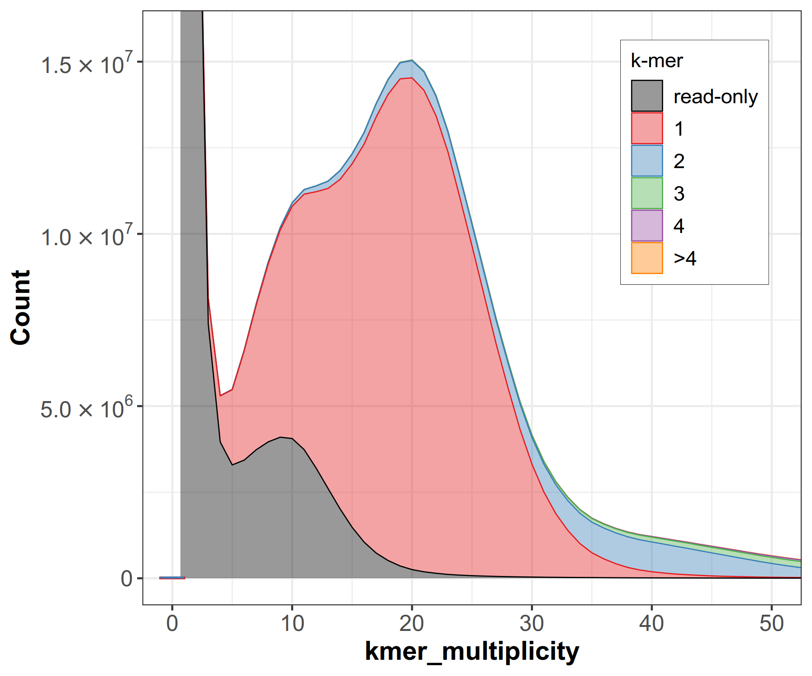

# Merqury plot for PacBio HiFi assemblies 

## spectral plots

  

The spectral plot shows that genome contains very diverse haplotypes see <https://github.com/marbl/merqury/issues/59>

Modifying purge_dup cutoff appears to make no significant difference base don the discussion here <https://github.com/dfguan/purge_dups/issues/14>

cutoff modified: 2 7 11 13 20 39
cutoff initial: 5 7 11 13 22 39

hamming error rate - measures teh occurrence of the k-mers from the unexpected haplotypes to the other in the entire assembly see <https://github.com/marbl/merqury/issues/53>
